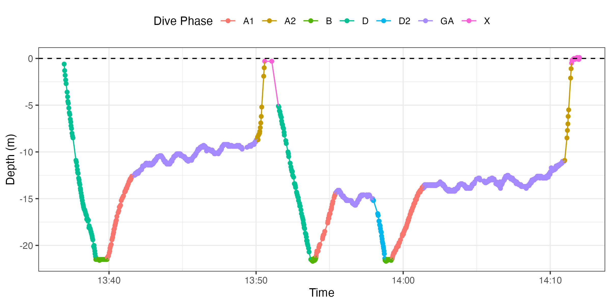
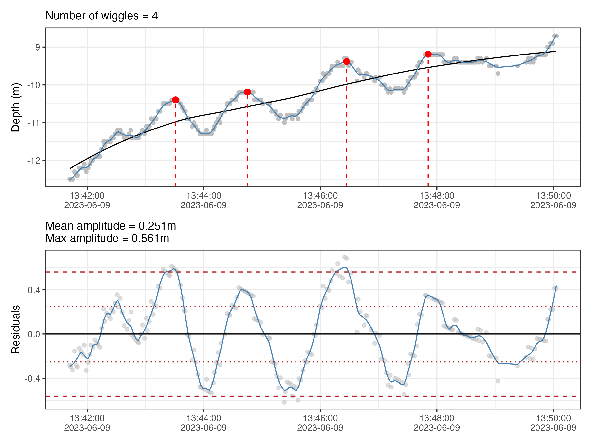
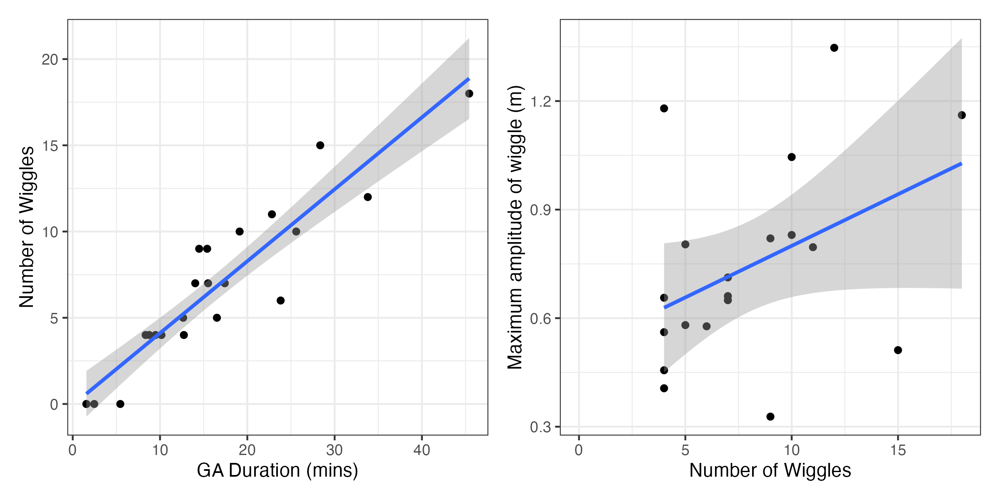

`wiggle_counter` Quick Guide
===================================

The `wiggle_counter` custom function assists in counting the number of wiggles and calculate the amplitude of wiggles from dive profile data.
This repository consists of the custom function used in Coppersmith et al. 2025 paper looking at fine-scale dive profiles of sea snakes.

<br>


Usage
--------------

Lets load some helpful packages

```r
sapply(c("tidyverse",
         "lubridate",
         "zoo",
         "patchwork"),
       require, character.only = TRUE)

```


We can now load up the custom function to calculate amplitude and wiggles per dive_id

```r
source("https://raw.githubusercontent.com/vinayudyawer/seasnake-wigglecounter/refs/heads/main/wiggle_counter.R")
```


Input example dive data

```r
track_dat <- read_csv("https://raw.githubusercontent.com/vinayudyawer/seasnake-wigglecounter/refs/heads/main/example_dive_data.csv")

## lets have a look at the data
track_dat

# # A tibble: 29,199 × 5
#    tag_id  date_time           dive_id dive_phase depth
#    <chr>   <dttm>                <dbl> <chr>      <dbl>
#  1 Snake_1 2023-06-09 00:00:01       0 X            0  
#  2 Snake_1 2023-06-09 00:00:03       0 X            0  
#  3 Snake_1 2023-06-09 00:00:05       0 X            0  
#  4 Snake_1 2023-06-09 00:00:07       0 X            0  
#  5 Snake_1 2023-06-09 00:00:09       0 X            0  
#  6 Snake_1 2023-06-09 00:00:11       0 X           -0.2
#  7 Snake_1 2023-06-09 00:00:13       0 X            0  
#  8 Snake_1 2023-06-09 00:00:15       0 X            0  
#  9 Snake_1 2023-06-09 00:00:17       0 X            0  
# 10 Snake_1 2023-06-09 00:00:19       0 X            0  
# # ℹ 29,189 more rows
# # ℹ Use `print(n = ...)` to see more rows

```


Lets plot the track data to have a look at the dive profile for a few dives (dive_id 25 & 26)

```r
track_dat %>% 
  filter(dive_id %in% 25:26) %>% 
  ggplot(aes(x = date_time, y = depth, color = dive_phase, group = tag_id)) +
  geom_point() +
  geom_path() +
  geom_hline(yintercept = 0, lty = 2) +
  theme_bw() +
  labs(x = "Time", y = "Depth (m)", color = "Dive Phase") +
  guides(colour = guide_legend(nrow = 1)) +
  theme(legend.position = "top")
  
```


<br>
<br>

We can visualise the wiggle counter data for the GA phase of dive_id 25

```r
track_dat %>%
  filter(dive_id %in% 25) %>%
  filter(dive_phase %in% "GA") %>%
  mutate(X = as.numeric(date_time), Y = depth) %>%
  wiggle_counter(., w = 16, smooth = 0.05)
```



<br>
<br>

Lets count wiggles across all the GA phase dives of this individual

```r
wig_dat <-
  track_dat %>% 
  filter(dive_phase %in% "GA") %>% 
  mutate(X = as.numeric(date_time), Y = depth) %>% 
  group_by(tag_id, dive_id) %>% 
  group_map(~ wiggle_counter(.x, w = 16, smooth = 0.05, plot = F), .keep = T) %>% 
  bind_rows()

## Lets look at patterns in wiggles 
wig_summary <-
  wig_dat %>% 
  group_by(tag_id, dive_id, n_wiggles, mean_amp, max_amp) %>% 
  summarise(duration_mins = min(date_time) %--% max(date_time) / dminutes(1))
```

<br>

Now we can look at broader patterns in the number and amplitude of wiggles

```r
plota <-
  wig_summary %>% 
  ggplot(aes(x = duration_mins, y = n_wiggles)) +
  geom_point() +
  geom_smooth(method = 'lm') +
  labs(x = "GA Duration (mins)", y = "Number of Wiggles") +
  theme_bw()

plotb <-
  wig_summary %>% 
  ggplot(aes(x = n_wiggles, y = max_amp)) +
  geom_point() +
  geom_smooth(method = 'lm') +
  labs(x = "Number of Wiggles", y = "Maximum amplitude of wiggle (m)") +
  theme_bw()

wrap_plots(plota, plotb, nrow = 1)

```




<br>
<br>

# Authors

Vinay Udyawer <br> <vinay.udyawer@gmail.com> <br><br>
Shannon Coppersmith <br> <shannon.coppersmith@adelaide.edu.au>

<br><br>

**Vignette version**
1.0 (13 Dec 2024)